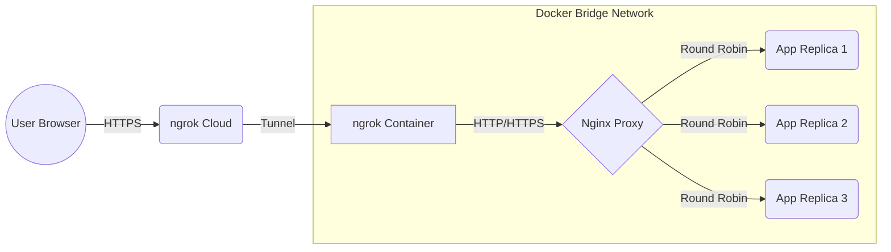

# Stateless Replica Monitor

Docker Compose と Nginx を活用した、ステートレスなバックエンドサービスの負荷分散（ロードバランシング）および高可用性構成を学習するためのプロジェクトです。

## 📋 プロジェクト概要

このプロジェクトは、単一の入り口（Nginx）から複数のバックエンド（Bun/Elysia）へリクエストを分散させる「Stateless」なアーキテクチャを構築します。どのコンテナがリクエストを処理しても、クライアントには一貫した体験が提供されます。

### 主な学習トピック

* **Docker Compose におけるサービススケーリング**: `--scale` オプションによる複数コンテナの管理。
* **Nginx によるリバースプロキシとロードバランシング**: `upstream` の動的な名前解決。
* **Docker 内部ネットワークの DNS 仕様**: 埋め込み DNS サーバー (`127.0.0.11`) の役割。
* **SSL 終端**: ローカル環境での `mkcert` を利用した HTTPS 化。

---

## 🏗️ システム構成



---

## 🚀 セットアップと実行

### 1. 準備 (SSL & Build)

ローカル開発用の信頼された証明書を生成し、フロントエンドをビルドします。

```bash
make ssl
cd application && bun run build.ts && cd ..
```

### 2. 起動

`make up` コマンドを使用して、アプリケーションを 3 台のレプリカ構成で起動します。

```bash
make up
```

*(内部実行: `docker compose up -d --build --scale application=3`)*

### 3. 停止・削除

```bash
make down
```

---

## 🔍 動作確認の方法

### ロードバランシングの検証

Nginx は Docker の内部 DNS を参照し、リクエストを各コンテナに振り分けます。以下のコマンドを連続で実行し、`container_id` が変化することを確認してください。

```bash
export APP_URL=$(curl -s http://localhost:4040/api/tunnels | jq -r '.tunnels[0].public_url')

# 5回連続でリクエストを送信
for i in {1..5}; do curl -k $APP_URL/api/whoami; echo ""; done
```

**期待される出力例:**

```json
{"message":"Hello from the cluster!","hostname":"2be726f1bd46","ip":"172.20.0.3","time":"2026-02-07T11:08:32.235Z"}
{"message":"Hello from the cluster!","hostname":"2bae0f1ac116","ip":"172.20.0.4","time":"2026-02-07T11:08:32.320Z"}
{"message":"Hello from the cluster!","hostname":"3a4b89cd3dda","ip":"172.20.0.5","time":"2026-02-07T11:08:32.486Z"}
{"message":"Hello from the cluster!","hostname":"2be726f1bd46","ip":"172.20.0.3","time":"2026-02-07T11:08:32.591Z"}
{"message":"Hello from the cluster!","hostname":"2bae0f1ac116","ip":"172.20.0.4","time":"2026-02-07T11:08:32.682Z"}
```

---

## 🛠️ 技術的特記事項

### Nginx の DNS resolver 設定

Docker のサービス名は動的に IP が割り当てられるため、Nginx の起動時キャッシュを無効化する工夫をしています。

* **Resolver 指定**: `resolver 127.0.0.11 valid=1s;` を設定し、Docker の埋め込み DNS を強制的に参照。
* **動的プロキシ**: `proxy_pass` に変数（例: `$target_api`）を使用することで、リクエストごとに名前解決を実行。

### Docker Swarm vs Compose

* **Compose**: ローカル開発に適しており、`build` や `volumes` の相対パス、`platform` 指定が柔軟。
* **Swarm**: 本番運用に適しているが、`build` 指定が無視される、`container_name` が使用不可、相対パスのマウントが制限される等の制約がある。
*※本プロジェクトの `make deploy` は Swarm モードでのデプロイを試行します。*

---

## 📂 ディレクトリ構造

* `application/`: Bun (Elysia.js) & React フロントエンド
* `nginx/`: Nginx 設定ファイルおよび Dockerfile
* `tools/`: 証明書生成、mkcert 導入用スクリプト
* `compose.yml`: マルチコンテナのオーケストレーション定義
* `Makefile`: 運用コマンドの集約

---
